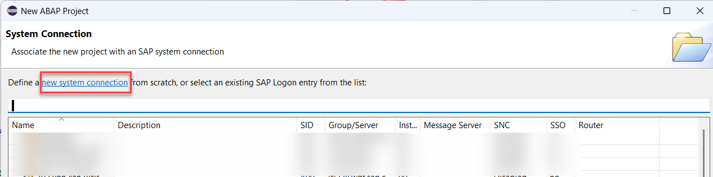
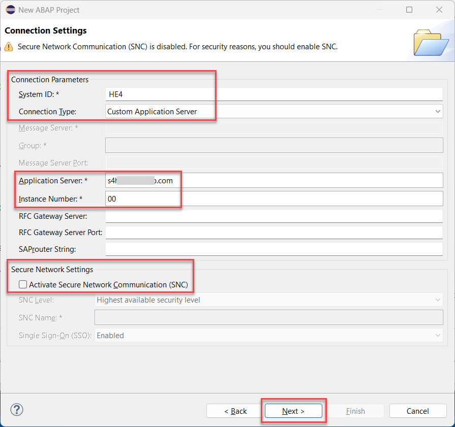

# Getting Started

In this exercise, you will prepare your ABAP development tools for Eclipse environment, create ABAP development project and select development packages required for your exercises 1-3.

## 🔴 Important Information

> **📌 Note**   
> We’ve got sessions running in several locations → please pick the one that’s right for you!

> **📌 Replace the two digits to get your group number:**
> * ZDT260_EX_**##** → **01** → **40** → **SAP TechEd Berlin**  (e.g ``ZDT260_EX_19``)
> * ZDT260_EX_**6##** → **600** → **699** → **ASUG Tech-Connect**  (e.g ``ZDT260_EX_623``)

## Introduction

1. The screenshots for these exercises have been prepared in the SAP TechEd system **`HE4`** using ABAP user **`DT260-00`** with the group ID **`00`**.
2. The explanation in the exercises will remind you to use your group number (indicated by **`##`**), e.g. ABAP class **`ZCL_FLIGHT_EVALUATION_EX_##`**. 
3. You will work in the standard ABAP package **`ZDT260_EX_##`** and transform your cloud ready ABAP artfacts to the ABAP Cloud package **`ZDT260_EX_##_5`**, where "5" indicates ABAP for Cloud Development language version.
4. Please note that ABAP development tools for Eclipse dialogs and views, as well as SAP Fiori UIs, may change in future releases.
5. You can find a solution for this workshop in the development package **`ZDT260_SOLUTION_5`**.

**Now, let's get started!**

1.	Start Eclipse on your desktop and switch to the ABAP Perspective.
   
    

2.	Create ABAP project by selecting **File** > **New** > **ABAP Project** and connect to the SAP TechEd system **`HE4`**. Use client **`400`**, your user **`DT260-##`**, and the password provided by the instructors.   

      

   > For **ASUG TechConnect** or if you don't see **`HE4`** in the list, define a new connection by clicking on the link  **new system connection**.
   > 
   > In the following screen enter 
   > - *System Id:* **`HE4`**
   > - *Connection Type:* select **`Custom Application Server`** from the drop down list
   > - *Application Server*: **`s4hana.tdc.sap.com`
   > - *Instance Number:* **`00`** 
   > - *▢* : **`Secure Network Communication (SNC)`**   
   >  
   > Be sure to **deactivate** the SNC checkbox. 
   >  
   > 
   > Click the **Next** button.
   >
   > and use client 400, your user DT260-##, and the password provided by the instructors to log on onto the system. 
   >  

3. Add your exercises packages for your group **`##`** to the **Favorite Packages*.
   
    

4. Finally add the solution package **`ZDT260_SOLUTION_5`** and the package **`ZDT260_FLIGHT_EVALUATION`** to your **Favorite Packages*.
   
    

5. Take a look at your packages (double-click on the package name to open it in the editor). The package **`ZDT260_EX_##`** has a standard ABAP language version, there your initial ABAP development objects are stored. The package **`ZDT260_EX_##_5`** has a cloud ABAP language version, there you will store your cloud ready ABAP development objects after modernization.
   
    
## Summary

Now you have set up your ABAP project and selected your development packages in your ABAP development tools for Eclipse development environment.
Continue to - [Exercise 1 - Modernize the Flight Evaluation application with ABAP Cloud](../ex1/README.md)
